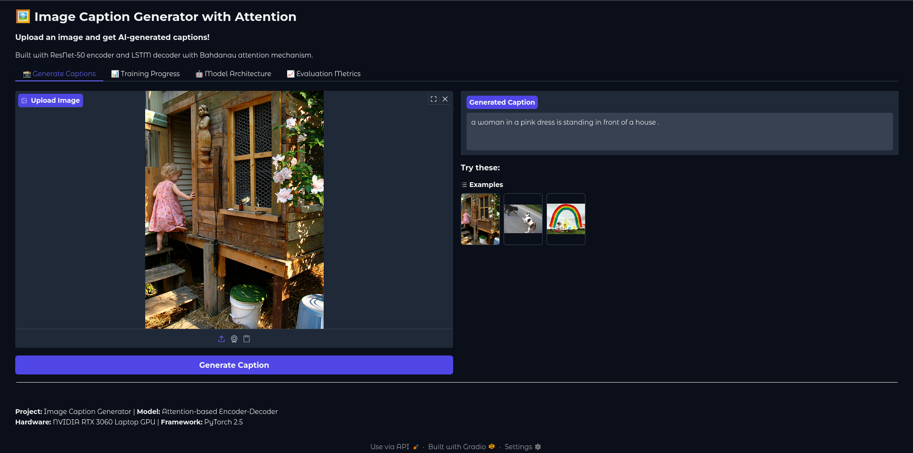
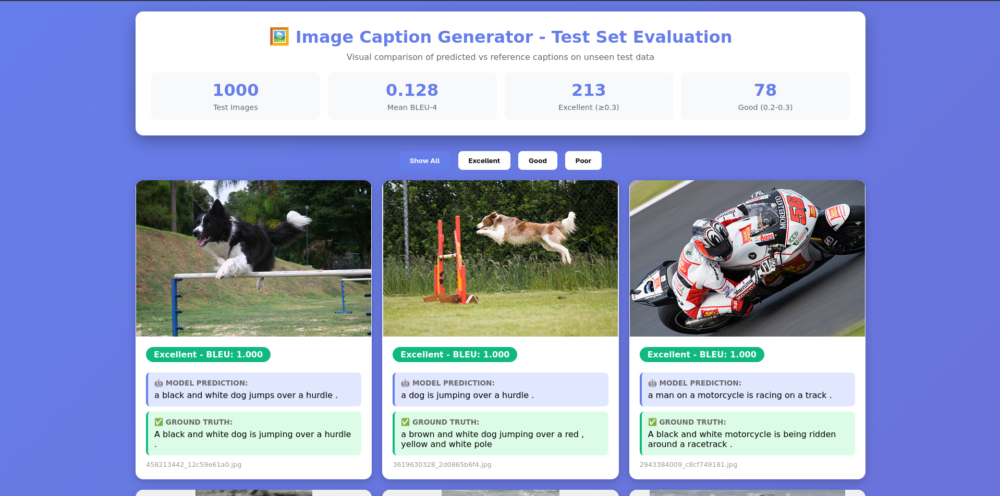

# 🖼️ Image Caption Generator with Attention Mechanism

[](https://www.python.org/downloads/)
[](https://pytorch.org/)
[](https://opensource.org/licenses/MIT)

A deep learning project that automatically generates natural language descriptions for images using an encoder-decoder architecture with Bahdanau attention mechanism.



## 📋 Table of Contents

- [Features](#features)
- [Architecture](#architecture)
- [Results](#results)
- [Installation](#installation)
- [Usage](#usage)
- [Project Structure](#project-structure)
- [Requirements](#requirements)
- [Acknowledgments](#acknowledgments)

## ✨ Features

- **Attention Mechanism**: Bahdanau (additive) attention for focusing on relevant image regions
- **Pre-trained Encoder**: ResNet-50 (ImageNet) for robust feature extraction
- **Spatial Features**: 7×7 grid (49 regions) for fine-grained attention
- **Interactive GUI**: Gradio-based web interface for easy caption generation
- **Comprehensive Evaluation**: BLEU-1/2/3/4 metrics with visual reports
- **Training Visualization**: Post-training loss curves from saved checkpoints

## 🏗️ Architecture

### Encoder
- **Model**: ResNet-50 (pretrained on ImageNet)
- **Output**: 49 spatial regions (7×7 grid)
- **Feature Dimension**: 2048 per region

### Attention Mechanism
- **Type**: Bahdanau (Additive) Attention
- **Attention Dim**: 512
- **Purpose**: Dynamic focus on relevant image regions per word

### Decoder
- **Model**: LSTM with attention
- **Embedding Dim**: 512
- **Hidden Dim**: 512
- **Vocabulary Size**: 2,590 words
- **Parameters**: 13.4M

## 📊 Results

The repository includes scripts for BLEU-1/2/3/4 evaluation on the Flickr8k test split and for plotting training/validation loss from saved checkpoints. Model checkpoints and generated evaluation artifacts are intentionally not stored in Git, so run the evaluation scripts against your own trained checkpoint before reporting results.

### Visual Test Evaluation

Below are sample predictions on unseen test images:



*Interactive HTML report available: Open `test_evaluation_report.html` to explore all test predictions with images.*

## 🚀 Installation

### Prerequisites
- Python 3.12+
- CUDA-capable GPU (recommended)
- 8GB+ RAM
- 10GB+ disk space

### Setup Steps

1. Clone the repository
```bash
git clone https://github.com/Triplejw/image-caption-generator.git
cd image-caption-generator
```

2. Create a virtual environment
```bash
python -m venv venv
source venv/bin/activate
```

3. Install dependencies
```bash
pip install torch torchvision torchaudio --index-url https://download.pytorch.org/whl/cu121
pip install -r requirements.txt
```

4. Download Flickr8k
```bash
mkdir -p ~/.kaggle
chmod 600 ~/.kaggle/kaggle.json
kaggle datasets download -d adityajn105/flickr8k
unzip flickr8k.zip -d data
```

## 🛠️ Technical Stack

- Deep Learning: PyTorch 2.5
- Computer Vision: ResNet-50
- NLP: NLTK, BLEU metrics
- GUI: Gradio
- Hardware: NVIDIA RTX 3060

## 🤝 Acknowledgments

- Dataset: Flickr8k from Kaggle
- Architecture: "Show, Attend and Tell" (Xu et al., 2015)
- Pre-trained Model: ResNet-50

## 📄 License

MIT License

## 👤 Author

**Joshua JJ Wonder**
- GitHub: @Triplejw
- Email: wonderjj2017@gmail.com

---

Built with ❤️ using PyTorch and Attention
